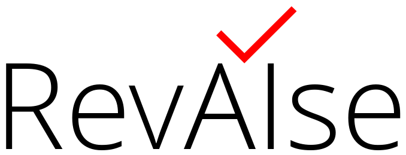

  

# RevAIse — Review AI Standard for Exchange

RevAIse is an open standard for describing, sharing, and reproducing AI-supported systematic reviews, organized by stages.

## Documentation

Full documentation is available at the [RevAIse GitHub Pages site](https://open-and-sustainable.github.io/revaise-model/).
It includes a reference for the data model and guidance on using the schema in your projects.

## Schema

The top-level schema [`schema/revaise.yaml`](schema/revaise.yaml) is intentionally lightweight, delegating detailed definitions to modular components under [`schema/model/`](schema/model/):

- [`core.yaml`](schema/model/core.yaml) aggregates shared enums and object definitions.
- [`objects/`](schema/model/objects/) splits reusable building blocks into dedicated files for reviews, protocols, AI use, artifacts, metrics, and more.
- [`stages/`](schema/model/stages/) holds workflow-specific modules such as [`search.yaml`](schema/model/stages/search.yaml), [`screening.yaml`](schema/model/stages/screening.yaml), and [`data_extraction.yaml`](schema/model/stages/data_extraction.yaml).
- [`profiles/`](schema/model/profiles/) provides validation profiles like [`full_release.yaml`](schema/model/profiles/full_release.yaml).

## Examples

Example data instances can be found in the [`examples/`](examples/) directory.

## License

This project is released under the [Creative Commons Zero v1.0 Universal](LICENSE) license.
**Author:** Riccardo Boero – [ribo@nilu.no](mailto:ribo@nilu.no)
