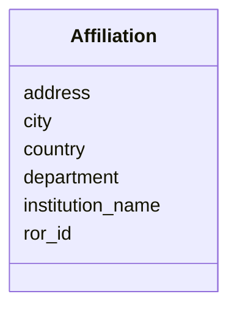

# Class: Affiliation 


_Institutional affiliation_


URI: [revaise:Affiliation](https://open-and-sustainable.github.io/revaise-model/schema/Affiliation)





<!-- no inheritance hierarchy -->


## Slots

| Name | Cardinality and Range | Description | Inheritance |
| ---  | --- | --- | --- |
| [institution_name](institution_name.md) | 1 <br/> [String](String.md) | Name of the institution | direct |
| [department](department.md) | 0..1 <br/> [String](String.md) | Department or division | direct |
| [address](address.md) | 0..1 <br/> [String](String.md) | Street address | direct |
| [city](city.md) | 0..1 <br/> [String](String.md) | City | direct |
| [country](country.md) | 0..1 <br/> [String](String.md) | Country | direct |
| [ror_id](ror_id.md) | 0..1 <br/> [String](String.md) | Research Organization Registry identifier | direct |


## Usages

| used by | used in | type | used |
| ---  | --- | --- | --- |
| [Author](Author.md) | [affiliations](affiliations.md) | range | [Affiliation](Affiliation.md) |


## Identifier and Mapping Information


### Schema Source


* from schema: https://open-and-sustainable.github.io/revaise-model/schema


## Mappings

| Mapping Type | Mapped Value |
| ---  | ---  |
| self | revaise:Affiliation |
| native | revaise:Affiliation |


## LinkML Source

<!-- TODO: investigate https://stackoverflow.com/questions/37606292/how-to-create-tabbed-code-blocks-in-mkdocs-or-sphinx -->

### Direct

<details>
```yaml
name: Affiliation
description: Institutional affiliation
from_schema: https://open-and-sustainable.github.io/revaise-model/schema
slots:
- institution_name
- department
- address
- city
- country
- ror_id
slot_usage:
  institution_name:
    name: institution_name
    description: Name of the institution
    range: string
    required: true
  department:
    name: department
    description: Department or division
    range: string
  address:
    name: address
    description: Street address
    range: string
  city:
    name: city
    description: City
    range: string
  country:
    name: country
    description: Country
    range: string
  ror_id:
    name: ror_id
    description: Research Organization Registry identifier
    range: string
    pattern: ^https://ror.org/0[a-z0-9]{8}$

```
</details>

### Induced

<details>
```yaml
name: Affiliation
description: Institutional affiliation
from_schema: https://open-and-sustainable.github.io/revaise-model/schema
slot_usage:
  institution_name:
    name: institution_name
    description: Name of the institution
    range: string
    required: true
  department:
    name: department
    description: Department or division
    range: string
  address:
    name: address
    description: Street address
    range: string
  city:
    name: city
    description: City
    range: string
  country:
    name: country
    description: Country
    range: string
  ror_id:
    name: ror_id
    description: Research Organization Registry identifier
    range: string
    pattern: ^https://ror.org/0[a-z0-9]{8}$
attributes:
  institution_name:
    name: institution_name
    description: Name of the institution
    from_schema: https://open-and-sustainable.github.io/revaise-model/schema
    rank: 1000
    alias: institution_name
    owner: Affiliation
    domain_of:
    - Affiliation
    range: string
    required: true
  department:
    name: department
    description: Department or division
    from_schema: https://open-and-sustainable.github.io/revaise-model/schema
    rank: 1000
    alias: department
    owner: Affiliation
    domain_of:
    - Affiliation
    range: string
  address:
    name: address
    description: Street address
    from_schema: https://open-and-sustainable.github.io/revaise-model/schema
    rank: 1000
    alias: address
    owner: Affiliation
    domain_of:
    - Affiliation
    range: string
  city:
    name: city
    description: City
    from_schema: https://open-and-sustainable.github.io/revaise-model/schema
    rank: 1000
    alias: city
    owner: Affiliation
    domain_of:
    - Affiliation
    range: string
  country:
    name: country
    description: Country
    from_schema: https://open-and-sustainable.github.io/revaise-model/schema
    rank: 1000
    alias: country
    owner: Affiliation
    domain_of:
    - Affiliation
    range: string
  ror_id:
    name: ror_id
    description: Research Organization Registry identifier
    from_schema: https://open-and-sustainable.github.io/revaise-model/schema
    rank: 1000
    alias: ror_id
    owner: Affiliation
    domain_of:
    - Affiliation
    range: string
    pattern: ^https://ror.org/0[a-z0-9]{8}$

```
</details>