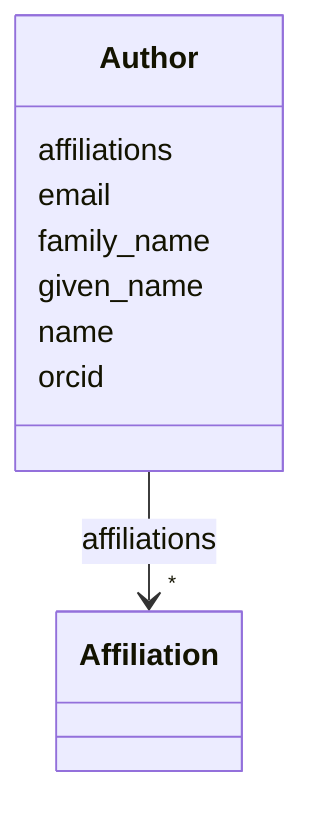

# Class: Author 


_Author of a review or publication_


URI: [revaise:Author](https://open-and-sustainable.github.io/revaise-model/schema/Author)





<!-- no inheritance hierarchy -->


## Slots

| Name | Cardinality and Range | Description | Inheritance |
| ---  | --- | --- | --- |
| [name](name.md) | 1 <br/> [String](String.md) | Full name of the author | direct |
| [given_name](given_name.md) | 0..1 <br/> [String](String.md) | Given/first name(s) | direct |
| [family_name](family_name.md) | 0..1 <br/> [String](String.md) | Family/last name | direct |
| [orcid](orcid.md) | 0..1 <br/> [String](String.md) | ORCID identifier | direct |
| [email](email.md) | 0..1 <br/> [String](String.md) | Contact email address | direct |
| [affiliations](affiliations.md) | * <br/> [Affiliation](Affiliation.md) | Institutional affiliations | direct |


## Usages

| used by | used in | type | used |
| ---  | --- | --- | --- |
| [LiteratureRecord](LiteratureRecord.md) | [authors](authors.md) | range | [Author](Author.md) |
| [Review](Review.md) | [review_authors](review_authors.md) | range | [Author](Author.md) |
| [Review](Review.md) | [corresponding_author](corresponding_author.md) | range | [Author](Author.md) |


## Identifier and Mapping Information


### Schema Source


* from schema: https://open-and-sustainable.github.io/revaise-model/schema


## Mappings

| Mapping Type | Mapped Value |
| ---  | ---  |
| self | revaise:Author |
| native | revaise:Author |


## LinkML Source

<!-- TODO: investigate https://stackoverflow.com/questions/37606292/how-to-create-tabbed-code-blocks-in-mkdocs-or-sphinx -->

### Direct

<details>
```yaml
name: Author
description: Author of a review or publication
from_schema: https://open-and-sustainable.github.io/revaise-model/schema
slots:
- name
- given_name
- family_name
- orcid
- email
- affiliations
slot_usage:
  name:
    name: name
    description: Full name of the author
    range: string
    required: true
  given_name:
    name: given_name
    description: Given/first name(s)
    range: string
  family_name:
    name: family_name
    description: Family/last name
    range: string
  orcid:
    name: orcid
    description: ORCID identifier
    range: string
    pattern: ^\d{4}-\d{4}-\d{4}-\d{3}[\dX]$
  email:
    name: email
    description: Contact email address
    range: string
  affiliations:
    name: affiliations
    description: Institutional affiliations
    range: Affiliation
    multivalued: true

```
</details>

### Induced

<details>
```yaml
name: Author
description: Author of a review or publication
from_schema: https://open-and-sustainable.github.io/revaise-model/schema
slot_usage:
  name:
    name: name
    description: Full name of the author
    range: string
    required: true
  given_name:
    name: given_name
    description: Given/first name(s)
    range: string
  family_name:
    name: family_name
    description: Family/last name
    range: string
  orcid:
    name: orcid
    description: ORCID identifier
    range: string
    pattern: ^\d{4}-\d{4}-\d{4}-\d{3}[\dX]$
  email:
    name: email
    description: Contact email address
    range: string
  affiliations:
    name: affiliations
    description: Institutional affiliations
    range: Affiliation
    multivalued: true
attributes:
  name:
    name: name
    description: Full name of the author
    from_schema: https://open-and-sustainable.github.io/revaise-model/schema
    rank: 1000
    alias: name
    owner: Author
    domain_of:
    - Author
    range: string
    required: true
  given_name:
    name: given_name
    description: Given/first name(s)
    from_schema: https://open-and-sustainable.github.io/revaise-model/schema
    rank: 1000
    alias: given_name
    owner: Author
    domain_of:
    - Author
    range: string
  family_name:
    name: family_name
    description: Family/last name
    from_schema: https://open-and-sustainable.github.io/revaise-model/schema
    rank: 1000
    alias: family_name
    owner: Author
    domain_of:
    - Author
    range: string
  orcid:
    name: orcid
    description: ORCID identifier
    from_schema: https://open-and-sustainable.github.io/revaise-model/schema
    rank: 1000
    alias: orcid
    owner: Author
    domain_of:
    - Author
    range: string
    pattern: ^\d{4}-\d{4}-\d{4}-\d{3}[\dX]$
  email:
    name: email
    description: Contact email address
    from_schema: https://open-and-sustainable.github.io/revaise-model/schema
    rank: 1000
    alias: email
    owner: Author
    domain_of:
    - Author
    range: string
  affiliations:
    name: affiliations
    description: Institutional affiliations
    from_schema: https://open-and-sustainable.github.io/revaise-model/schema
    rank: 1000
    alias: affiliations
    owner: Author
    domain_of:
    - Author
    range: Affiliation
    multivalued: true

```
</details>