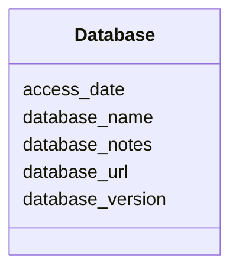

# Class: Database 


_Information about a database used for searching_


URI: [revaise:Database](https://open-and-sustainable.github.io/revaise-model/schema/Database)





<!-- no inheritance hierarchy -->


## Slots

| Name | Cardinality and Range | Description | Inheritance |
| ---  | --- | --- | --- |
| [database_name](database_name.md) | 1 <br/> [String](String.md) | Name of the database (e | direct |
| [database_url](database_url.md) | 1 <br/> [Uri](Uri.md) | URL to access the database | direct |
| [access_date](access_date.md) | 0..1 <br/> [Datetime](Datetime.md) | Date when the database was accessed | direct |
| [database_version](database_version.md) | 0..1 <br/> [String](String.md) | Version or release of the database | direct |
| [database_notes](database_notes.md) | 0..1 <br/> [String](String.md) | Additional notes about database access or limitations | direct |


## Usages

| used by | used in | type | used |
| ---  | --- | --- | --- |
| [SearchStage](SearchStage.md) | [databases](databases.md) | range | [Database](Database.md) |


## Identifier and Mapping Information


### Schema Source


* from schema: https://open-and-sustainable.github.io/revaise-model/schema


## Mappings

| Mapping Type | Mapped Value |
| ---  | ---  |
| self | revaise:Database |
| native | revaise:Database |


## LinkML Source

<!-- TODO: investigate https://stackoverflow.com/questions/37606292/how-to-create-tabbed-code-blocks-in-mkdocs-or-sphinx -->

### Direct

<details>
```yaml
name: Database
description: Information about a database used for searching
from_schema: https://open-and-sustainable.github.io/revaise-model/schema
slots:
- database_name
- database_url
- access_date
- database_version
- database_notes
slot_usage:
  database_name:
    name: database_name
    description: Name of the database (e.g., PubMed, Scopus, Web of Science)
    range: string
    required: true
  database_url:
    name: database_url
    description: URL to access the database
    range: uri
    required: true
  access_date:
    name: access_date
    description: Date when the database was accessed
    range: datetime
  database_version:
    name: database_version
    description: Version or release of the database
    range: string
  database_notes:
    name: database_notes
    description: Additional notes about database access or limitations
    range: string

```
</details>

### Induced

<details>
```yaml
name: Database
description: Information about a database used for searching
from_schema: https://open-and-sustainable.github.io/revaise-model/schema
slot_usage:
  database_name:
    name: database_name
    description: Name of the database (e.g., PubMed, Scopus, Web of Science)
    range: string
    required: true
  database_url:
    name: database_url
    description: URL to access the database
    range: uri
    required: true
  access_date:
    name: access_date
    description: Date when the database was accessed
    range: datetime
  database_version:
    name: database_version
    description: Version or release of the database
    range: string
  database_notes:
    name: database_notes
    description: Additional notes about database access or limitations
    range: string
attributes:
  database_name:
    name: database_name
    description: Name of the database (e.g., PubMed, Scopus, Web of Science)
    from_schema: https://open-and-sustainable.github.io/revaise-model/schema
    rank: 1000
    alias: database_name
    owner: Database
    domain_of:
    - Database
    - SearchQuery
    range: string
    required: true
  database_url:
    name: database_url
    description: URL to access the database
    from_schema: https://open-and-sustainable.github.io/revaise-model/schema
    rank: 1000
    alias: database_url
    owner: Database
    domain_of:
    - Database
    range: uri
    required: true
  access_date:
    name: access_date
    description: Date when the database was accessed
    from_schema: https://open-and-sustainable.github.io/revaise-model/schema
    rank: 1000
    alias: access_date
    owner: Database
    domain_of:
    - Database
    range: datetime
  database_version:
    name: database_version
    description: Version or release of the database
    from_schema: https://open-and-sustainable.github.io/revaise-model/schema
    rank: 1000
    alias: database_version
    owner: Database
    domain_of:
    - Database
    range: string
  database_notes:
    name: database_notes
    description: Additional notes about database access or limitations
    from_schema: https://open-and-sustainable.github.io/revaise-model/schema
    rank: 1000
    alias: database_notes
    owner: Database
    domain_of:
    - Database
    range: string

```
</details>