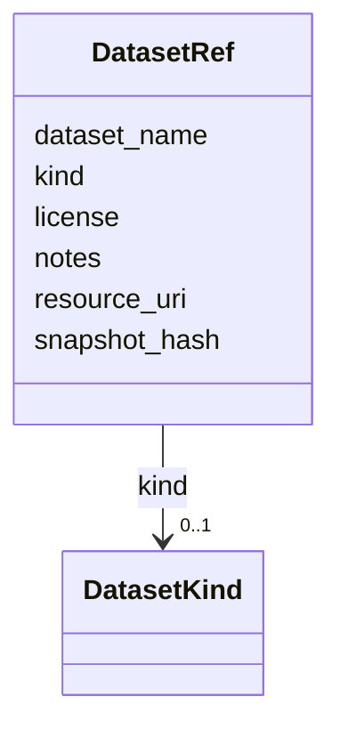

# Class: DatasetRef 


_External dataset reference._


URI: [revaise:DatasetRef](https://open-and-sustainable.github.io/revaise-model/schema/DatasetRef)





<!-- no inheritance hierarchy -->


## Slots

| Name | Cardinality and Range | Description | Inheritance |
| ---  | --- | --- | --- |
| [kind](kind.md) | 0..1 <br/> [DatasetKind](DatasetKind.md) | Kind or type of stage output | direct |
| [dataset_name](dataset_name.md) | 0..1 <br/> [String](String.md) | Name of the dataset | direct |
| [resource_uri](resource_uri.md) | 0..1 <br/> [Uri](Uri.md) | URI locating the resource | direct |
| [snapshot_hash](snapshot_hash.md) | 0..1 <br/> [String](String.md) | Checksum of the dataset snapshot | direct |
| [license](license.md) | 0..1 <br/> [String](String.md) | License governing the dataset | direct |
| [notes](notes.md) | 0..1 <br/> [String](String.md) | Additional notes | direct |


## Identifier and Mapping Information


### Schema Source


* from schema: https://open-and-sustainable.github.io/revaise-model/schema


## Mappings

| Mapping Type | Mapped Value |
| ---  | ---  |
| self | revaise:DatasetRef |
| native | revaise:DatasetRef |


## LinkML Source

<!-- TODO: investigate https://stackoverflow.com/questions/37606292/how-to-create-tabbed-code-blocks-in-mkdocs-or-sphinx -->

### Direct

<details>
```yaml
name: DatasetRef
description: External dataset reference.
from_schema: https://open-and-sustainable.github.io/revaise-model/schema
slots:
- kind
- dataset_name
- resource_uri
- snapshot_hash
- license
- notes
slot_usage:
  kind:
    name: kind
    range: DatasetKind

```
</details>

### Induced

<details>
```yaml
name: DatasetRef
description: External dataset reference.
from_schema: https://open-and-sustainable.github.io/revaise-model/schema
slot_usage:
  kind:
    name: kind
    range: DatasetKind
attributes:
  kind:
    name: kind
    description: Kind or type of stage output
    from_schema: https://open-and-sustainable.github.io/revaise-model/schema
    rank: 1000
    alias: kind
    owner: DatasetRef
    domain_of:
    - StageOutput
    - DatasetRef
    range: DatasetKind
  dataset_name:
    name: dataset_name
    description: Name of the dataset
    from_schema: https://open-and-sustainable.github.io/revaise-model/schema
    rank: 1000
    alias: dataset_name
    owner: DatasetRef
    domain_of:
    - DatasetRef
    range: string
  resource_uri:
    name: resource_uri
    description: URI locating the resource
    from_schema: https://open-and-sustainable.github.io/revaise-model/schema
    rank: 1000
    alias: resource_uri
    owner: DatasetRef
    domain_of:
    - StageOutput
    - StageOutputRef
    - DatasetRef
    range: uri
  snapshot_hash:
    name: snapshot_hash
    description: Checksum of the dataset snapshot
    from_schema: https://open-and-sustainable.github.io/revaise-model/schema
    rank: 1000
    alias: snapshot_hash
    owner: DatasetRef
    domain_of:
    - DatasetRef
    range: string
  license:
    name: license
    description: License governing the dataset
    from_schema: https://open-and-sustainable.github.io/revaise-model/schema
    rank: 1000
    alias: license
    owner: DatasetRef
    domain_of:
    - DatasetRef
    range: string
  notes:
    name: notes
    description: Additional notes
    from_schema: https://open-and-sustainable.github.io/revaise-model/schema
    rank: 1000
    alias: notes
    owner: DatasetRef
    domain_of:
    - DatasetRef
    range: string

```
</details>