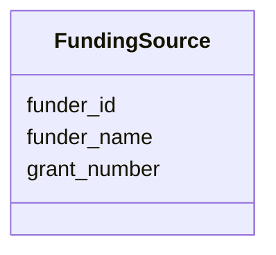

# Class: FundingSource 


_Source of funding for the review_


URI: [revaise:FundingSource](https://open-and-sustainable.github.io/revaise-model/schema/FundingSource)





<!-- no inheritance hierarchy -->


## Slots

| Name | Cardinality and Range | Description | Inheritance |
| ---  | --- | --- | --- |
| [funder_name](funder_name.md) | 1 <br/> [String](String.md) | Name of the funding organization | direct |
| [grant_number](grant_number.md) | 0..1 <br/> [String](String.md) | Grant or award number | direct |
| [funder_id](funder_id.md) | 0..1 <br/> [String](String.md) | Funder identifier (e | direct |


## Usages

| used by | used in | type | used |
| ---  | --- | --- | --- |
| [Review](Review.md) | [funding_sources](funding_sources.md) | range | [FundingSource](FundingSource.md) |


## Identifier and Mapping Information


### Schema Source


* from schema: https://open-and-sustainable.github.io/revaise-model/schema


## Mappings

| Mapping Type | Mapped Value |
| ---  | ---  |
| self | revaise:FundingSource |
| native | revaise:FundingSource |


## LinkML Source

<!-- TODO: investigate https://stackoverflow.com/questions/37606292/how-to-create-tabbed-code-blocks-in-mkdocs-or-sphinx -->

### Direct

<details>
```yaml
name: FundingSource
description: Source of funding for the review
from_schema: https://open-and-sustainable.github.io/revaise-model/schema
slots:
- funder_name
- grant_number
- funder_id
slot_usage:
  funder_name:
    name: funder_name
    description: Name of the funding organization
    range: string
    required: true
  grant_number:
    name: grant_number
    description: Grant or award number
    range: string
  funder_id:
    name: funder_id
    description: Funder identifier (e.g., Crossref Funder ID)
    range: string

```
</details>

### Induced

<details>
```yaml
name: FundingSource
description: Source of funding for the review
from_schema: https://open-and-sustainable.github.io/revaise-model/schema
slot_usage:
  funder_name:
    name: funder_name
    description: Name of the funding organization
    range: string
    required: true
  grant_number:
    name: grant_number
    description: Grant or award number
    range: string
  funder_id:
    name: funder_id
    description: Funder identifier (e.g., Crossref Funder ID)
    range: string
attributes:
  funder_name:
    name: funder_name
    description: Name of the funding organization
    from_schema: https://open-and-sustainable.github.io/revaise-model/schema
    rank: 1000
    alias: funder_name
    owner: FundingSource
    domain_of:
    - FundingSource
    range: string
    required: true
  grant_number:
    name: grant_number
    description: Grant or award number
    from_schema: https://open-and-sustainable.github.io/revaise-model/schema
    rank: 1000
    alias: grant_number
    owner: FundingSource
    domain_of:
    - FundingSource
    range: string
  funder_id:
    name: funder_id
    description: Funder identifier (e.g., Crossref Funder ID)
    from_schema: https://open-and-sustainable.github.io/revaise-model/schema
    rank: 1000
    alias: funder_id
    owner: FundingSource
    domain_of:
    - FundingSource
    range: string

```
</details>