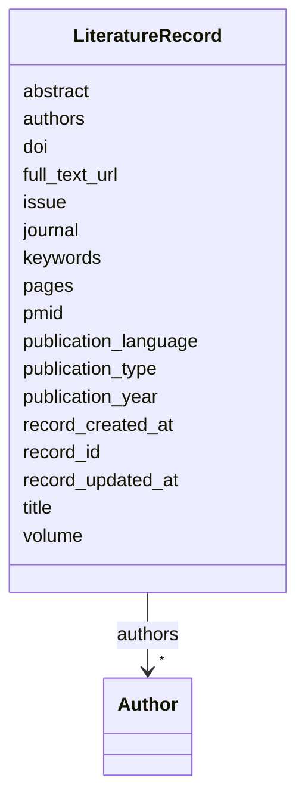

# Class: LiteratureRecord 


_A literature record representing a publication that persists across review stages._


URI: [revaise:LiteratureRecord](https://open-and-sustainable.github.io/revaise-model/schema/LiteratureRecord)





<!-- no inheritance hierarchy -->


## Slots

| Name | Cardinality and Range | Description | Inheritance |
| ---  | --- | --- | --- |
| [record_id](record_id.md) | 1 <br/> [String](String.md) | Unique identifier for this literature record | direct |
| [title](title.md) | 1 <br/> [String](String.md) | Title of the publication | direct |
| [authors](authors.md) | * <br/> [Author](Author.md) | Authors of the publication | direct |
| [publication_year](publication_year.md) | 0..1 <br/> [Integer](Integer.md) | Year of publication | direct |
| [abstract](abstract.md) | 0..1 <br/> [String](String.md) | Abstract of the publication | direct |
| [doi](doi.md) | 0..1 <br/> [String](String.md) | Digital Object Identifier | direct |
| [pmid](pmid.md) | 0..1 <br/> [String](String.md) | PubMed identifier | direct |
| [journal](journal.md) | 0..1 <br/> [String](String.md) | Journal name | direct |
| [volume](volume.md) | 0..1 <br/> [String](String.md) | Volume number | direct |
| [issue](issue.md) | 0..1 <br/> [String](String.md) | Issue number | direct |
| [pages](pages.md) | 0..1 <br/> [String](String.md) | Page range | direct |
| [publication_language](publication_language.md) | 0..1 <br/> [String](String.md) | Language of publication | direct |
| [publication_type](publication_type.md) | 0..1 <br/> [String](String.md) | Type of publication | direct |
| [keywords](keywords.md) | * <br/> [String](String.md) | Keywords | direct |
| [full_text_url](full_text_url.md) | 0..1 <br/> [Uri](Uri.md) | URL to full text | direct |
| [record_created_at](record_created_at.md) | 0..1 <br/> [Datetime](Datetime.md) | When this record was created | direct |
| [record_updated_at](record_updated_at.md) | 0..1 <br/> [Datetime](Datetime.md) | Last update timestamp | direct |


## Usages

| used by | used in | type | used |
| ---  | --- | --- | --- |
| [LiteratureRecordCollection](LiteratureRecordCollection.md) | [records](records.md) | range | [LiteratureRecord](LiteratureRecord.md) |
| [Review](Review.md) | [literature_records](literature_records.md) | range | [LiteratureRecord](LiteratureRecord.md) |


## Identifier and Mapping Information


### Schema Source


* from schema: https://open-and-sustainable.github.io/revaise-model/schema


## Mappings

| Mapping Type | Mapped Value |
| ---  | ---  |
| self | revaise:LiteratureRecord |
| native | revaise:LiteratureRecord |


## LinkML Source

<!-- TODO: investigate https://stackoverflow.com/questions/37606292/how-to-create-tabbed-code-blocks-in-mkdocs-or-sphinx -->

### Direct

<details>
```yaml
name: LiteratureRecord
description: A literature record representing a publication that persists across review
  stages.
from_schema: https://open-and-sustainable.github.io/revaise-model/schema
slots:
- record_id
- title
- authors
- publication_year
- abstract
- doi
- pmid
- journal
- volume
- issue
- pages
- publication_language
- publication_type
- keywords
- full_text_url
- record_created_at
- record_updated_at
slot_usage:
  record_id:
    name: record_id
    description: Unique identifier for this literature record
    identifier: true
    required: true
  title:
    name: title
    description: Title of the publication
    required: true
  authors:
    name: authors
    description: Authors of the publication
    range: Author
    multivalued: true
  publication_year:
    name: publication_year
    description: Year of publication
    range: integer
  abstract:
    name: abstract
    description: Abstract of the publication
    range: string
  doi:
    name: doi
    description: Digital Object Identifier
    range: string
  pmid:
    name: pmid
    description: PubMed identifier
    range: string
  journal:
    name: journal
    description: Journal name
    range: string
  volume:
    name: volume
    description: Volume number
    range: string
  issue:
    name: issue
    description: Issue number
    range: string
  pages:
    name: pages
    description: Page range
    range: string
  publication_language:
    name: publication_language
    description: Language of publication
    range: string
  publication_type:
    name: publication_type
    description: Type of publication
    range: string
  keywords:
    name: keywords
    description: Keywords
    range: string
    multivalued: true
  full_text_url:
    name: full_text_url
    description: URL to full text
    range: uri
  record_created_at:
    name: record_created_at
    description: When this record was created
    range: datetime
  record_updated_at:
    name: record_updated_at
    description: Last update timestamp
    range: datetime

```
</details>

### Induced

<details>
```yaml
name: LiteratureRecord
description: A literature record representing a publication that persists across review
  stages.
from_schema: https://open-and-sustainable.github.io/revaise-model/schema
slot_usage:
  record_id:
    name: record_id
    description: Unique identifier for this literature record
    identifier: true
    required: true
  title:
    name: title
    description: Title of the publication
    required: true
  authors:
    name: authors
    description: Authors of the publication
    range: Author
    multivalued: true
  publication_year:
    name: publication_year
    description: Year of publication
    range: integer
  abstract:
    name: abstract
    description: Abstract of the publication
    range: string
  doi:
    name: doi
    description: Digital Object Identifier
    range: string
  pmid:
    name: pmid
    description: PubMed identifier
    range: string
  journal:
    name: journal
    description: Journal name
    range: string
  volume:
    name: volume
    description: Volume number
    range: string
  issue:
    name: issue
    description: Issue number
    range: string
  pages:
    name: pages
    description: Page range
    range: string
  publication_language:
    name: publication_language
    description: Language of publication
    range: string
  publication_type:
    name: publication_type
    description: Type of publication
    range: string
  keywords:
    name: keywords
    description: Keywords
    range: string
    multivalued: true
  full_text_url:
    name: full_text_url
    description: URL to full text
    range: uri
  record_created_at:
    name: record_created_at
    description: When this record was created
    range: datetime
  record_updated_at:
    name: record_updated_at
    description: Last update timestamp
    range: datetime
attributes:
  record_id:
    name: record_id
    description: Unique identifier for this literature record
    from_schema: https://open-and-sustainable.github.io/revaise-model/schema
    rank: 1000
    identifier: true
    alias: record_id
    owner: LiteratureRecord
    domain_of:
    - LiteratureRecord
    range: string
    required: true
  title:
    name: title
    description: Title of the publication
    from_schema: https://open-and-sustainable.github.io/revaise-model/schema
    rank: 1000
    alias: title
    owner: LiteratureRecord
    domain_of:
    - LiteratureRecord
    range: string
    required: true
  authors:
    name: authors
    description: Authors of the publication
    from_schema: https://open-and-sustainable.github.io/revaise-model/schema
    rank: 1000
    alias: authors
    owner: LiteratureRecord
    domain_of:
    - LiteratureRecord
    range: Author
    multivalued: true
  publication_year:
    name: publication_year
    description: Year of publication
    from_schema: https://open-and-sustainable.github.io/revaise-model/schema
    rank: 1000
    alias: publication_year
    owner: LiteratureRecord
    domain_of:
    - LiteratureRecord
    range: integer
  abstract:
    name: abstract
    description: Abstract of the publication
    from_schema: https://open-and-sustainable.github.io/revaise-model/schema
    rank: 1000
    alias: abstract
    owner: LiteratureRecord
    domain_of:
    - LiteratureRecord
    range: string
  doi:
    name: doi
    description: Digital Object Identifier
    from_schema: https://open-and-sustainable.github.io/revaise-model/schema
    rank: 1000
    alias: doi
    owner: LiteratureRecord
    domain_of:
    - LiteratureRecord
    range: string
  pmid:
    name: pmid
    description: PubMed identifier
    from_schema: https://open-and-sustainable.github.io/revaise-model/schema
    rank: 1000
    alias: pmid
    owner: LiteratureRecord
    domain_of:
    - LiteratureRecord
    range: string
  journal:
    name: journal
    description: Journal name
    from_schema: https://open-and-sustainable.github.io/revaise-model/schema
    rank: 1000
    alias: journal
    owner: LiteratureRecord
    domain_of:
    - LiteratureRecord
    range: string
  volume:
    name: volume
    description: Volume number
    from_schema: https://open-and-sustainable.github.io/revaise-model/schema
    rank: 1000
    alias: volume
    owner: LiteratureRecord
    domain_of:
    - LiteratureRecord
    range: string
  issue:
    name: issue
    description: Issue number
    from_schema: https://open-and-sustainable.github.io/revaise-model/schema
    rank: 1000
    alias: issue
    owner: LiteratureRecord
    domain_of:
    - LiteratureRecord
    range: string
  pages:
    name: pages
    description: Page range
    from_schema: https://open-and-sustainable.github.io/revaise-model/schema
    rank: 1000
    alias: pages
    owner: LiteratureRecord
    domain_of:
    - LiteratureRecord
    range: string
  publication_language:
    name: publication_language
    description: Language of publication
    from_schema: https://open-and-sustainable.github.io/revaise-model/schema
    rank: 1000
    alias: publication_language
    owner: LiteratureRecord
    domain_of:
    - LiteratureRecord
    range: string
  publication_type:
    name: publication_type
    description: Type of publication
    from_schema: https://open-and-sustainable.github.io/revaise-model/schema
    rank: 1000
    alias: publication_type
    owner: LiteratureRecord
    domain_of:
    - LiteratureRecord
    range: string
  keywords:
    name: keywords
    description: Keywords
    from_schema: https://open-and-sustainable.github.io/revaise-model/schema
    rank: 1000
    alias: keywords
    owner: LiteratureRecord
    domain_of:
    - LiteratureRecord
    range: string
    multivalued: true
  full_text_url:
    name: full_text_url
    description: URL to full text
    from_schema: https://open-and-sustainable.github.io/revaise-model/schema
    rank: 1000
    alias: full_text_url
    owner: LiteratureRecord
    domain_of:
    - LiteratureRecord
    range: uri
  record_created_at:
    name: record_created_at
    description: When this record was created
    from_schema: https://open-and-sustainable.github.io/revaise-model/schema
    rank: 1000
    alias: record_created_at
    owner: LiteratureRecord
    domain_of:
    - LiteratureRecord
    range: datetime
  record_updated_at:
    name: record_updated_at
    description: Last update timestamp
    from_schema: https://open-and-sustainable.github.io/revaise-model/schema
    rank: 1000
    alias: record_updated_at
    owner: LiteratureRecord
    domain_of:
    - LiteratureRecord
    range: datetime

```
</details>