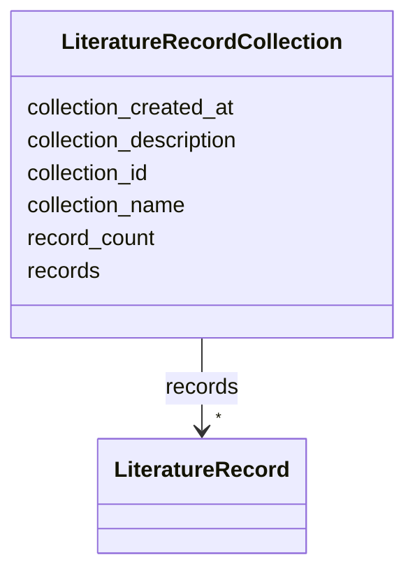

# Class: LiteratureRecordCollection 


_A collection of literature records_


URI: [revaise:LiteratureRecordCollection](https://open-and-sustainable.github.io/revaise-model/schema/LiteratureRecordCollection)





<!-- no inheritance hierarchy -->


## Slots

| Name | Cardinality and Range | Description | Inheritance |
| ---  | --- | --- | --- |
| [collection_id](collection_id.md) | 1 <br/> [String](String.md) | Unique identifier for this collection | direct |
| [collection_name](collection_name.md) | 1 <br/> [String](String.md) | Name of the collection | direct |
| [collection_description](collection_description.md) | 0..1 <br/> [String](String.md) | Description of this collection | direct |
| [records](records.md) | * <br/> [LiteratureRecord](LiteratureRecord.md) | Literature records in this collection | direct |
| [record_count](record_count.md) | 0..1 <br/> [Integer](Integer.md) | Number of records in this collection | direct |
| [collection_created_at](collection_created_at.md) | 0..1 <br/> [Datetime](Datetime.md) | When this collection was created | direct |


## Usages

| used by | used in | type | used |
| ---  | --- | --- | --- |
| [SearchStage](SearchStage.md) | [result_collections](result_collections.md) | range | [LiteratureRecordCollection](LiteratureRecordCollection.md) |


## Identifier and Mapping Information


### Schema Source


* from schema: https://open-and-sustainable.github.io/revaise-model/schema


## Mappings

| Mapping Type | Mapped Value |
| ---  | ---  |
| self | revaise:LiteratureRecordCollection |
| native | revaise:LiteratureRecordCollection |


## LinkML Source

<!-- TODO: investigate https://stackoverflow.com/questions/37606292/how-to-create-tabbed-code-blocks-in-mkdocs-or-sphinx -->

### Direct

<details>
```yaml
name: LiteratureRecordCollection
description: A collection of literature records
from_schema: https://open-and-sustainable.github.io/revaise-model/schema
slots:
- collection_id
- collection_name
- collection_description
- records
- record_count
- collection_created_at
slot_usage:
  collection_id:
    name: collection_id
    description: Unique identifier for this collection
    identifier: true
    required: true
  collection_name:
    name: collection_name
    description: Name of the collection
    range: string
    required: true
  collection_description:
    name: collection_description
    description: Description of this collection
    range: string
  records:
    name: records
    description: Literature records in this collection
    range: LiteratureRecord
    multivalued: true
  record_count:
    name: record_count
    description: Number of records in this collection
    range: integer
  collection_created_at:
    name: collection_created_at
    description: When this collection was created
    range: datetime

```
</details>

### Induced

<details>
```yaml
name: LiteratureRecordCollection
description: A collection of literature records
from_schema: https://open-and-sustainable.github.io/revaise-model/schema
slot_usage:
  collection_id:
    name: collection_id
    description: Unique identifier for this collection
    identifier: true
    required: true
  collection_name:
    name: collection_name
    description: Name of the collection
    range: string
    required: true
  collection_description:
    name: collection_description
    description: Description of this collection
    range: string
  records:
    name: records
    description: Literature records in this collection
    range: LiteratureRecord
    multivalued: true
  record_count:
    name: record_count
    description: Number of records in this collection
    range: integer
  collection_created_at:
    name: collection_created_at
    description: When this collection was created
    range: datetime
attributes:
  collection_id:
    name: collection_id
    description: Unique identifier for this collection
    from_schema: https://open-and-sustainable.github.io/revaise-model/schema
    rank: 1000
    identifier: true
    alias: collection_id
    owner: LiteratureRecordCollection
    domain_of:
    - LiteratureRecordCollection
    range: string
    required: true
  collection_name:
    name: collection_name
    description: Name of the collection
    from_schema: https://open-and-sustainable.github.io/revaise-model/schema
    rank: 1000
    alias: collection_name
    owner: LiteratureRecordCollection
    domain_of:
    - LiteratureRecordCollection
    range: string
    required: true
  collection_description:
    name: collection_description
    description: Description of this collection
    from_schema: https://open-and-sustainable.github.io/revaise-model/schema
    rank: 1000
    alias: collection_description
    owner: LiteratureRecordCollection
    domain_of:
    - LiteratureRecordCollection
    range: string
  records:
    name: records
    description: Literature records in this collection
    from_schema: https://open-and-sustainable.github.io/revaise-model/schema
    rank: 1000
    alias: records
    owner: LiteratureRecordCollection
    domain_of:
    - LiteratureRecordCollection
    range: LiteratureRecord
    multivalued: true
  record_count:
    name: record_count
    description: Number of records in this collection
    from_schema: https://open-and-sustainable.github.io/revaise-model/schema
    rank: 1000
    alias: record_count
    owner: LiteratureRecordCollection
    domain_of:
    - LiteratureRecordCollection
    range: integer
  collection_created_at:
    name: collection_created_at
    description: When this collection was created
    from_schema: https://open-and-sustainable.github.io/revaise-model/schema
    rank: 1000
    alias: collection_created_at
    owner: LiteratureRecordCollection
    domain_of:
    - LiteratureRecordCollection
    range: datetime

```
</details>