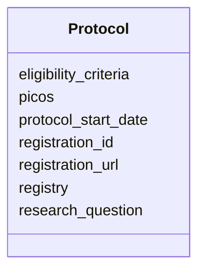

# Class: Protocol 


_Scoping and registration details of the review._


URI: [revaise:Protocol](https://open-and-sustainable.github.io/revaise-model/schema/Protocol)





<!-- no inheritance hierarchy -->


## Slots

| Name | Cardinality and Range | Description | Inheritance |
| ---  | --- | --- | --- |
| [registry](registry.md) | 0..1 <br/> [String](String.md) | Registry where the protocol is recorded | direct |
| [registration_id](registration_id.md) | 0..1 <br/> [String](String.md) | Identifier assigned by the registry | direct |
| [registration_url](registration_url.md) | 0..1 <br/> [Uri](Uri.md) | URL to the registry entry | direct |
| [research_question](research_question.md) | 0..1 <br/> [String](String.md) | Primary research question | direct |
| [eligibility_criteria](eligibility_criteria.md) | 0..1 <br/> [String](String.md) | Inclusion and exclusion criteria | direct |
| [picos](picos.md) | 0..1 <br/> [String](String.md) | Population, Intervention, Comparison, Outcomes, Study design details | direct |
| [protocol_start_date](protocol_start_date.md) | 0..1 <br/> [Date](Date.md) | Protocol registration date | direct |


## Usages

| used by | used in | type | used |
| ---  | --- | --- | --- |
| [Review](Review.md) | [protocol](protocol.md) | range | [Protocol](Protocol.md) |


## Identifier and Mapping Information


### Schema Source


* from schema: https://open-and-sustainable.github.io/revaise-model/schema


## Mappings

| Mapping Type | Mapped Value |
| ---  | ---  |
| self | revaise:Protocol |
| native | revaise:Protocol |


## LinkML Source

<!-- TODO: investigate https://stackoverflow.com/questions/37606292/how-to-create-tabbed-code-blocks-in-mkdocs-or-sphinx -->

### Direct

<details>
```yaml
name: Protocol
description: Scoping and registration details of the review.
from_schema: https://open-and-sustainable.github.io/revaise-model/schema
slots:
- registry
- registration_id
- registration_url
- research_question
- eligibility_criteria
- picos
- protocol_start_date

```
</details>

### Induced

<details>
```yaml
name: Protocol
description: Scoping and registration details of the review.
from_schema: https://open-and-sustainable.github.io/revaise-model/schema
attributes:
  registry:
    name: registry
    description: Registry where the protocol is recorded
    from_schema: https://open-and-sustainable.github.io/revaise-model/schema
    rank: 1000
    alias: registry
    owner: Protocol
    domain_of:
    - Protocol
    range: string
  registration_id:
    name: registration_id
    description: Identifier assigned by the registry
    from_schema: https://open-and-sustainable.github.io/revaise-model/schema
    rank: 1000
    alias: registration_id
    owner: Protocol
    domain_of:
    - Protocol
    range: string
  registration_url:
    name: registration_url
    description: URL to the registry entry
    from_schema: https://open-and-sustainable.github.io/revaise-model/schema
    rank: 1000
    alias: registration_url
    owner: Protocol
    domain_of:
    - Protocol
    range: uri
  research_question:
    name: research_question
    description: Primary research question
    from_schema: https://open-and-sustainable.github.io/revaise-model/schema
    rank: 1000
    alias: research_question
    owner: Protocol
    domain_of:
    - Protocol
    range: string
  eligibility_criteria:
    name: eligibility_criteria
    description: Inclusion and exclusion criteria
    from_schema: https://open-and-sustainable.github.io/revaise-model/schema
    rank: 1000
    alias: eligibility_criteria
    owner: Protocol
    domain_of:
    - Protocol
    range: string
  picos:
    name: picos
    description: Population, Intervention, Comparison, Outcomes, Study design details
    from_schema: https://open-and-sustainable.github.io/revaise-model/schema
    rank: 1000
    alias: picos
    owner: Protocol
    domain_of:
    - Protocol
    range: string
  protocol_start_date:
    name: protocol_start_date
    description: Protocol registration date
    from_schema: https://open-and-sustainable.github.io/revaise-model/schema
    rank: 1000
    alias: protocol_start_date
    owner: Protocol
    domain_of:
    - Protocol
    range: date

```
</details>