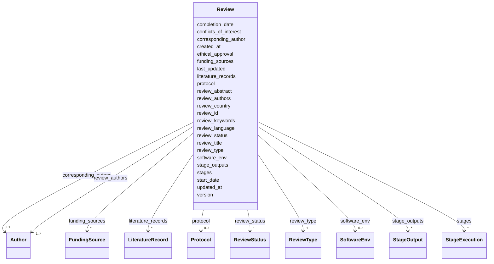

# Class: Review 


_Root container for a systematic review. This is the primary object that contains all review data, stages, literature records, and artifacts. Every RevAIse document should have a Review as its top-level object._


URI: [revaise:Review](https://open-and-sustainable.github.io/revaise-model/schema/Review)





<!-- no inheritance hierarchy -->


## Slots

| Name | Cardinality and Range | Description | Inheritance |
| ---  | --- | --- | --- |
| [review_id](review_id.md) | 1 <br/> [String](String.md) | Unique identifier for this review | direct |
| [review_title](review_title.md) | 1 <br/> [String](String.md) | Title of the systematic review | direct |
| [review_type](review_type.md) | 1 <br/> [ReviewType](ReviewType.md) | Type of review being conducted | direct |
| [review_abstract](review_abstract.md) | 0..1 <br/> [String](String.md) | Abstract or summary of the review | direct |
| [review_keywords](review_keywords.md) | * <br/> [String](String.md) | Keywords or tags for the review | direct |
| [protocol](protocol.md) | 0..1 <br/> [Protocol](Protocol.md) | Review protocol with registration details | direct |
| [review_authors](review_authors.md) | 1..* <br/> [Author](Author.md) | Review authors | direct |
| [corresponding_author](corresponding_author.md) | 0..1 <br/> [Author](Author.md) | Corresponding author for the review | direct |
| [review_status](review_status.md) | 1 <br/> [ReviewStatus](ReviewStatus.md) | Current status of the review | direct |
| [version](version.md) | 0..1 <br/> [String](String.md) | Version of the review | direct |
| [review_language](review_language.md) | 0..1 <br/> [String](String.md) | Primary language of the review | direct |
| [review_country](review_country.md) | 0..1 <br/> [String](String.md) | Country where review is conducted | direct |
| [start_date](start_date.md) | 0..1 <br/> [Date](Date.md) | Date review started | direct |
| [completion_date](completion_date.md) | 0..1 <br/> [Date](Date.md) | Date review completed | direct |
| [last_updated](last_updated.md) | 0..1 <br/> [Datetime](Datetime.md) | Last update to the review | direct |
| [created_at](created_at.md) | 0..1 <br/> [Datetime](Datetime.md) | When this review record was created | direct |
| [updated_at](updated_at.md) | 0..1 <br/> [Datetime](Datetime.md) | When this review record was last updated | direct |
| [funding_sources](funding_sources.md) | * <br/> [FundingSource](FundingSource.md) | Sources of funding for the review | direct |
| [conflicts_of_interest](conflicts_of_interest.md) | 0..1 <br/> [String](String.md) | Declaration of conflicts of interest | direct |
| [ethical_approval](ethical_approval.md) | 0..1 <br/> [String](String.md) | Ethical approval information if applicable | direct |
| [stages](stages.md) | * <br/> [StageExecution](StageExecution.md) | Stages executed in this review | direct |
| [literature_records](literature_records.md) | * <br/> [LiteratureRecord](LiteratureRecord.md) | Literature records managed in this review | direct |
| [stage_outputs](stage_outputs.md) | * <br/> [StageOutput](StageOutput.md) | Outputs and logs produced by the review stages | direct |
| [software_env](software_env.md) | 0..1 <br/> [SoftwareEnv](SoftwareEnv.md) | Software environment for reproducibility | direct |


## Identifier and Mapping Information


### Schema Source


* from schema: https://open-and-sustainable.github.io/revaise-model/schema


## Mappings

| Mapping Type | Mapped Value |
| ---  | ---  |
| self | revaise:Review |
| native | revaise:Review |


## LinkML Source

<!-- TODO: investigate https://stackoverflow.com/questions/37606292/how-to-create-tabbed-code-blocks-in-mkdocs-or-sphinx -->

### Direct

<details>
```yaml
name: Review
description: Root container for a systematic review. This is the primary object that
  contains all review data, stages, literature records, and artifacts. Every RevAIse
  document should have a Review as its top-level object.
from_schema: https://open-and-sustainable.github.io/revaise-model/schema
slots:
- review_id
- review_title
- review_type
- review_abstract
- review_keywords
- protocol
- review_authors
- corresponding_author
- review_status
- version
- review_language
- review_country
- start_date
- completion_date
- last_updated
- created_at
- updated_at
- funding_sources
- conflicts_of_interest
- ethical_approval
- stages
- literature_records
- stage_outputs
- software_env
slot_usage:
  review_id:
    name: review_id
    description: Unique identifier for this review
    identifier: true
    required: true
  review_title:
    name: review_title
    description: Title of the systematic review
    required: true
  review_type:
    name: review_type
    description: Type of review being conducted
    range: ReviewType
    required: true
  review_abstract:
    name: review_abstract
    description: Abstract or summary of the review
    range: string
  review_keywords:
    name: review_keywords
    description: Keywords or tags for the review
    range: string
    multivalued: true
  protocol:
    name: protocol
    description: Review protocol with registration details
    range: Protocol
  review_authors:
    name: review_authors
    description: Review authors
    range: Author
    required: true
    multivalued: true
    minimum_cardinality: 1
  corresponding_author:
    name: corresponding_author
    description: Corresponding author for the review
    range: Author
  review_status:
    name: review_status
    description: Current status of the review
    range: ReviewStatus
    required: true
  version:
    name: version
    description: Version of the review
    range: string
  review_language:
    name: review_language
    description: Primary language of the review
    range: string
  review_country:
    name: review_country
    description: Country where review is conducted
    range: string
  start_date:
    name: start_date
    description: Date review started
    range: date
  completion_date:
    name: completion_date
    description: Date review completed
    range: date
  last_updated:
    name: last_updated
    description: Last update to the review
    range: datetime
  created_at:
    name: created_at
    description: When this review record was created
    range: datetime
  updated_at:
    name: updated_at
    description: When this review record was last updated
    range: datetime
  funding_sources:
    name: funding_sources
    description: Sources of funding for the review
    range: FundingSource
    multivalued: true
  conflicts_of_interest:
    name: conflicts_of_interest
    description: Declaration of conflicts of interest
    range: string
  ethical_approval:
    name: ethical_approval
    description: Ethical approval information if applicable
    range: string
  stages:
    name: stages
    description: Stages executed in this review
    range: StageExecution
    multivalued: true
  literature_records:
    name: literature_records
    description: Literature records managed in this review
    range: LiteratureRecord
    multivalued: true
  stage_outputs:
    name: stage_outputs
    description: Outputs and logs produced by the review stages
    range: StageOutput
    multivalued: true
  software_env:
    name: software_env
    description: Software environment for reproducibility
    range: SoftwareEnv

```
</details>

### Induced

<details>
```yaml
name: Review
description: Root container for a systematic review. This is the primary object that
  contains all review data, stages, literature records, and artifacts. Every RevAIse
  document should have a Review as its top-level object.
from_schema: https://open-and-sustainable.github.io/revaise-model/schema
slot_usage:
  review_id:
    name: review_id
    description: Unique identifier for this review
    identifier: true
    required: true
  review_title:
    name: review_title
    description: Title of the systematic review
    required: true
  review_type:
    name: review_type
    description: Type of review being conducted
    range: ReviewType
    required: true
  review_abstract:
    name: review_abstract
    description: Abstract or summary of the review
    range: string
  review_keywords:
    name: review_keywords
    description: Keywords or tags for the review
    range: string
    multivalued: true
  protocol:
    name: protocol
    description: Review protocol with registration details
    range: Protocol
  review_authors:
    name: review_authors
    description: Review authors
    range: Author
    required: true
    multivalued: true
    minimum_cardinality: 1
  corresponding_author:
    name: corresponding_author
    description: Corresponding author for the review
    range: Author
  review_status:
    name: review_status
    description: Current status of the review
    range: ReviewStatus
    required: true
  version:
    name: version
    description: Version of the review
    range: string
  review_language:
    name: review_language
    description: Primary language of the review
    range: string
  review_country:
    name: review_country
    description: Country where review is conducted
    range: string
  start_date:
    name: start_date
    description: Date review started
    range: date
  completion_date:
    name: completion_date
    description: Date review completed
    range: date
  last_updated:
    name: last_updated
    description: Last update to the review
    range: datetime
  created_at:
    name: created_at
    description: When this review record was created
    range: datetime
  updated_at:
    name: updated_at
    description: When this review record was last updated
    range: datetime
  funding_sources:
    name: funding_sources
    description: Sources of funding for the review
    range: FundingSource
    multivalued: true
  conflicts_of_interest:
    name: conflicts_of_interest
    description: Declaration of conflicts of interest
    range: string
  ethical_approval:
    name: ethical_approval
    description: Ethical approval information if applicable
    range: string
  stages:
    name: stages
    description: Stages executed in this review
    range: StageExecution
    multivalued: true
  literature_records:
    name: literature_records
    description: Literature records managed in this review
    range: LiteratureRecord
    multivalued: true
  stage_outputs:
    name: stage_outputs
    description: Outputs and logs produced by the review stages
    range: StageOutput
    multivalued: true
  software_env:
    name: software_env
    description: Software environment for reproducibility
    range: SoftwareEnv
attributes:
  review_id:
    name: review_id
    description: Unique identifier for this review
    from_schema: https://open-and-sustainable.github.io/revaise-model/schema
    rank: 1000
    identifier: true
    alias: review_id
    owner: Review
    domain_of:
    - Review
    range: string
    required: true
  review_title:
    name: review_title
    description: Title of the systematic review
    from_schema: https://open-and-sustainable.github.io/revaise-model/schema
    rank: 1000
    alias: review_title
    owner: Review
    domain_of:
    - Review
    range: string
    required: true
  review_type:
    name: review_type
    description: Type of review being conducted
    from_schema: https://open-and-sustainable.github.io/revaise-model/schema
    rank: 1000
    alias: review_type
    owner: Review
    domain_of:
    - Review
    range: ReviewType
    required: true
  review_abstract:
    name: review_abstract
    description: Abstract or summary of the review
    from_schema: https://open-and-sustainable.github.io/revaise-model/schema
    rank: 1000
    alias: review_abstract
    owner: Review
    domain_of:
    - Review
    range: string
  review_keywords:
    name: review_keywords
    description: Keywords or tags for the review
    from_schema: https://open-and-sustainable.github.io/revaise-model/schema
    rank: 1000
    alias: review_keywords
    owner: Review
    domain_of:
    - Review
    range: string
    multivalued: true
  protocol:
    name: protocol
    description: Review protocol with registration details
    from_schema: https://open-and-sustainable.github.io/revaise-model/schema
    rank: 1000
    alias: protocol
    owner: Review
    domain_of:
    - Review
    range: Protocol
  review_authors:
    name: review_authors
    description: Review authors
    from_schema: https://open-and-sustainable.github.io/revaise-model/schema
    rank: 1000
    alias: review_authors
    owner: Review
    domain_of:
    - Review
    range: Author
    required: true
    multivalued: true
    minimum_cardinality: 1
  corresponding_author:
    name: corresponding_author
    description: Corresponding author for the review
    from_schema: https://open-and-sustainable.github.io/revaise-model/schema
    rank: 1000
    alias: corresponding_author
    owner: Review
    domain_of:
    - Review
    range: Author
  review_status:
    name: review_status
    description: Current status of the review
    from_schema: https://open-and-sustainable.github.io/revaise-model/schema
    rank: 1000
    alias: review_status
    owner: Review
    domain_of:
    - Review
    range: ReviewStatus
    required: true
  version:
    name: version
    description: Version of the review
    from_schema: https://open-and-sustainable.github.io/revaise-model/schema
    rank: 1000
    alias: version
    owner: Review
    domain_of:
    - Review
    range: string
  review_language:
    name: review_language
    description: Primary language of the review
    from_schema: https://open-and-sustainable.github.io/revaise-model/schema
    rank: 1000
    alias: review_language
    owner: Review
    domain_of:
    - Review
    range: string
  review_country:
    name: review_country
    description: Country where review is conducted
    from_schema: https://open-and-sustainable.github.io/revaise-model/schema
    rank: 1000
    alias: review_country
    owner: Review
    domain_of:
    - Review
    range: string
  start_date:
    name: start_date
    description: Date review started
    from_schema: https://open-and-sustainable.github.io/revaise-model/schema
    rank: 1000
    alias: start_date
    owner: Review
    domain_of:
    - Review
    range: date
  completion_date:
    name: completion_date
    description: Date review completed
    from_schema: https://open-and-sustainable.github.io/revaise-model/schema
    rank: 1000
    alias: completion_date
    owner: Review
    domain_of:
    - Review
    range: date
  last_updated:
    name: last_updated
    description: Last update to the review
    from_schema: https://open-and-sustainable.github.io/revaise-model/schema
    rank: 1000
    alias: last_updated
    owner: Review
    domain_of:
    - Review
    range: datetime
  created_at:
    name: created_at
    description: When this review record was created
    from_schema: https://open-and-sustainable.github.io/revaise-model/schema
    rank: 1000
    alias: created_at
    owner: Review
    domain_of:
    - Review
    range: datetime
  updated_at:
    name: updated_at
    description: When this review record was last updated
    from_schema: https://open-and-sustainable.github.io/revaise-model/schema
    rank: 1000
    alias: updated_at
    owner: Review
    domain_of:
    - Review
    range: datetime
  funding_sources:
    name: funding_sources
    description: Sources of funding for the review
    from_schema: https://open-and-sustainable.github.io/revaise-model/schema
    rank: 1000
    alias: funding_sources
    owner: Review
    domain_of:
    - Review
    range: FundingSource
    multivalued: true
  conflicts_of_interest:
    name: conflicts_of_interest
    description: Declaration of conflicts of interest
    from_schema: https://open-and-sustainable.github.io/revaise-model/schema
    rank: 1000
    alias: conflicts_of_interest
    owner: Review
    domain_of:
    - Review
    range: string
  ethical_approval:
    name: ethical_approval
    description: Ethical approval information if applicable
    from_schema: https://open-and-sustainable.github.io/revaise-model/schema
    rank: 1000
    alias: ethical_approval
    owner: Review
    domain_of:
    - Review
    range: string
  stages:
    name: stages
    description: Stages executed in this review
    from_schema: https://open-and-sustainable.github.io/revaise-model/schema
    rank: 1000
    alias: stages
    owner: Review
    domain_of:
    - Review
    range: StageExecution
    multivalued: true
  literature_records:
    name: literature_records
    description: Literature records managed in this review
    from_schema: https://open-and-sustainable.github.io/revaise-model/schema
    rank: 1000
    alias: literature_records
    owner: Review
    domain_of:
    - Review
    range: LiteratureRecord
    multivalued: true
  stage_outputs:
    name: stage_outputs
    description: Outputs and logs produced by the review stages
    from_schema: https://open-and-sustainable.github.io/revaise-model/schema
    rank: 1000
    alias: stage_outputs
    owner: Review
    domain_of:
    - Review
    range: StageOutput
    multivalued: true
  software_env:
    name: software_env
    description: Software environment for reproducibility
    from_schema: https://open-and-sustainable.github.io/revaise-model/schema
    rank: 1000
    alias: software_env
    owner: Review
    domain_of:
    - Review
    range: SoftwareEnv

```
</details>