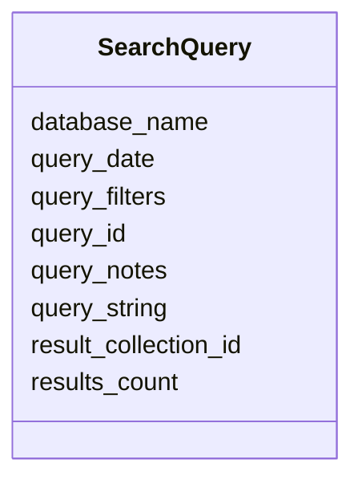

# Class: SearchQuery 


_Search query executed against a database_


URI: [revaise:SearchQuery](https://open-and-sustainable.github.io/revaise-model/schema/SearchQuery)





<!-- no inheritance hierarchy -->


## Slots

| Name | Cardinality and Range | Description | Inheritance |
| ---  | --- | --- | --- |
| [query_id](query_id.md) | 1 <br/> [String](String.md) | Unique identifier for the search query | direct |
| [database_name](database_name.md) | 1 <br/> [String](String.md) | Name of the database where query was executed | direct |
| [query_string](query_string.md) | 1 <br/> [String](String.md) | The actual search query string or expression | direct |
| [query_date](query_date.md) | 1 <br/> [Datetime](Datetime.md) | Date and time when the query was executed | direct |
| [query_filters](query_filters.md) | * <br/> [String](String.md) | Filters applied (e | direct |
| [result_collection_id](result_collection_id.md) | 0..1 <br/> [String](String.md) | Reference to the LiteratureRecordCollection containing results | direct |
| [results_count](results_count.md) | 0..1 <br/> [Integer](Integer.md) | Number of results returned by the query | direct |
| [query_notes](query_notes.md) | 0..1 <br/> [String](String.md) | Additional notes about the query or its execution | direct |


## Usages

| used by | used in | type | used |
| ---  | --- | --- | --- |
| [SearchStage](SearchStage.md) | [search_queries](search_queries.md) | range | [SearchQuery](SearchQuery.md) |


## Identifier and Mapping Information


### Schema Source


* from schema: https://open-and-sustainable.github.io/revaise-model/schema


## Mappings

| Mapping Type | Mapped Value |
| ---  | ---  |
| self | revaise:SearchQuery |
| native | revaise:SearchQuery |


## LinkML Source

<!-- TODO: investigate https://stackoverflow.com/questions/37606292/how-to-create-tabbed-code-blocks-in-mkdocs-or-sphinx -->

### Direct

<details>
```yaml
name: SearchQuery
description: Search query executed against a database
from_schema: https://open-and-sustainable.github.io/revaise-model/schema
slots:
- query_id
- database_name
- query_string
- query_date
- query_filters
- result_collection_id
- results_count
- query_notes
slot_usage:
  query_id:
    name: query_id
    description: Unique identifier for the search query
    identifier: true
    range: string
  database_name:
    name: database_name
    description: Name of the database where query was executed
    range: string
    required: true
  query_string:
    name: query_string
    description: The actual search query string or expression
    range: string
    required: true
  query_date:
    name: query_date
    description: Date and time when the query was executed
    range: datetime
    required: true
  query_filters:
    name: query_filters
    description: Filters applied (e.g., date range, language, study type)
    range: string
    multivalued: true
  result_collection_id:
    name: result_collection_id
    description: Reference to the LiteratureRecordCollection containing results
    range: string
  results_count:
    name: results_count
    description: Number of results returned by the query
    range: integer
  query_notes:
    name: query_notes
    description: Additional notes about the query or its execution
    range: string

```
</details>

### Induced

<details>
```yaml
name: SearchQuery
description: Search query executed against a database
from_schema: https://open-and-sustainable.github.io/revaise-model/schema
slot_usage:
  query_id:
    name: query_id
    description: Unique identifier for the search query
    identifier: true
    range: string
  database_name:
    name: database_name
    description: Name of the database where query was executed
    range: string
    required: true
  query_string:
    name: query_string
    description: The actual search query string or expression
    range: string
    required: true
  query_date:
    name: query_date
    description: Date and time when the query was executed
    range: datetime
    required: true
  query_filters:
    name: query_filters
    description: Filters applied (e.g., date range, language, study type)
    range: string
    multivalued: true
  result_collection_id:
    name: result_collection_id
    description: Reference to the LiteratureRecordCollection containing results
    range: string
  results_count:
    name: results_count
    description: Number of results returned by the query
    range: integer
  query_notes:
    name: query_notes
    description: Additional notes about the query or its execution
    range: string
attributes:
  query_id:
    name: query_id
    description: Unique identifier for the search query
    from_schema: https://open-and-sustainable.github.io/revaise-model/schema
    rank: 1000
    identifier: true
    alias: query_id
    owner: SearchQuery
    domain_of:
    - SearchQuery
    range: string
  database_name:
    name: database_name
    description: Name of the database where query was executed
    from_schema: https://open-and-sustainable.github.io/revaise-model/schema
    rank: 1000
    alias: database_name
    owner: SearchQuery
    domain_of:
    - Database
    - SearchQuery
    range: string
    required: true
  query_string:
    name: query_string
    description: The actual search query string or expression
    from_schema: https://open-and-sustainable.github.io/revaise-model/schema
    rank: 1000
    alias: query_string
    owner: SearchQuery
    domain_of:
    - SearchQuery
    range: string
    required: true
  query_date:
    name: query_date
    description: Date and time when the query was executed
    from_schema: https://open-and-sustainable.github.io/revaise-model/schema
    rank: 1000
    alias: query_date
    owner: SearchQuery
    domain_of:
    - SearchQuery
    range: datetime
    required: true
  query_filters:
    name: query_filters
    description: Filters applied (e.g., date range, language, study type)
    from_schema: https://open-and-sustainable.github.io/revaise-model/schema
    rank: 1000
    alias: query_filters
    owner: SearchQuery
    domain_of:
    - SearchQuery
    range: string
    multivalued: true
  result_collection_id:
    name: result_collection_id
    description: Reference to the LiteratureRecordCollection containing results
    from_schema: https://open-and-sustainable.github.io/revaise-model/schema
    rank: 1000
    alias: result_collection_id
    owner: SearchQuery
    domain_of:
    - SearchQuery
    range: string
  results_count:
    name: results_count
    description: Number of results returned by the query
    from_schema: https://open-and-sustainable.github.io/revaise-model/schema
    rank: 1000
    alias: results_count
    owner: SearchQuery
    domain_of:
    - SearchQuery
    range: integer
  query_notes:
    name: query_notes
    description: Additional notes about the query or its execution
    from_schema: https://open-and-sustainable.github.io/revaise-model/schema
    rank: 1000
    alias: query_notes
    owner: SearchQuery
    domain_of:
    - SearchQuery
    range: string

```
</details>