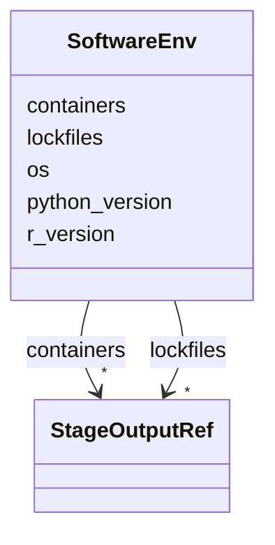

# Class: SoftwareEnv 


_Software environment configuration._


URI: [revaise:SoftwareEnv](https://open-and-sustainable.github.io/revaise-model/schema/SoftwareEnv)





<!-- no inheritance hierarchy -->


## Slots

| Name | Cardinality and Range | Description | Inheritance |
| ---  | --- | --- | --- |
| [os](os.md) | 0..1 <br/> [String](String.md) | Operating system description | direct |
| [python_version](python_version.md) | 0..1 <br/> [String](String.md) | Python version | direct |
| [r_version](r_version.md) | 0..1 <br/> [String](String.md) | R version | direct |
| [containers](containers.md) | * <br/> [StageOutputRef](StageOutputRef.md) | Container images used | direct |
| [lockfiles](lockfiles.md) | * <br/> [StageOutputRef](StageOutputRef.md) | Environment lockfiles | direct |


## Usages

| used by | used in | type | used |
| ---  | --- | --- | --- |
| [Review](Review.md) | [software_env](software_env.md) | range | [SoftwareEnv](SoftwareEnv.md) |


## Identifier and Mapping Information


### Schema Source


* from schema: https://open-and-sustainable.github.io/revaise-model/schema


## Mappings

| Mapping Type | Mapped Value |
| ---  | ---  |
| self | revaise:SoftwareEnv |
| native | revaise:SoftwareEnv |


## LinkML Source

<!-- TODO: investigate https://stackoverflow.com/questions/37606292/how-to-create-tabbed-code-blocks-in-mkdocs-or-sphinx -->

### Direct

<details>
```yaml
name: SoftwareEnv
description: Software environment configuration.
from_schema: https://open-and-sustainable.github.io/revaise-model/schema
slots:
- os
- python_version
- r_version
- containers
- lockfiles
slot_usage:
  containers:
    name: containers
    range: StageOutputRef
    multivalued: true
  lockfiles:
    name: lockfiles
    range: StageOutputRef
    multivalued: true

```
</details>

### Induced

<details>
```yaml
name: SoftwareEnv
description: Software environment configuration.
from_schema: https://open-and-sustainable.github.io/revaise-model/schema
slot_usage:
  containers:
    name: containers
    range: StageOutputRef
    multivalued: true
  lockfiles:
    name: lockfiles
    range: StageOutputRef
    multivalued: true
attributes:
  os:
    name: os
    description: Operating system description
    from_schema: https://open-and-sustainable.github.io/revaise-model/schema
    rank: 1000
    alias: os
    owner: SoftwareEnv
    domain_of:
    - SoftwareEnv
    range: string
  python_version:
    name: python_version
    description: Python version
    from_schema: https://open-and-sustainable.github.io/revaise-model/schema
    rank: 1000
    alias: python_version
    owner: SoftwareEnv
    domain_of:
    - SoftwareEnv
    range: string
  r_version:
    name: r_version
    description: R version
    from_schema: https://open-and-sustainable.github.io/revaise-model/schema
    rank: 1000
    alias: r_version
    owner: SoftwareEnv
    domain_of:
    - SoftwareEnv
    range: string
  containers:
    name: containers
    description: Container images used
    from_schema: https://open-and-sustainable.github.io/revaise-model/schema
    rank: 1000
    alias: containers
    owner: SoftwareEnv
    domain_of:
    - SoftwareEnv
    range: StageOutputRef
    multivalued: true
  lockfiles:
    name: lockfiles
    description: Environment lockfiles
    from_schema: https://open-and-sustainable.github.io/revaise-model/schema
    rank: 1000
    alias: lockfiles
    owner: SoftwareEnv
    domain_of:
    - SoftwareEnv
    range: StageOutputRef
    multivalued: true

```
</details>