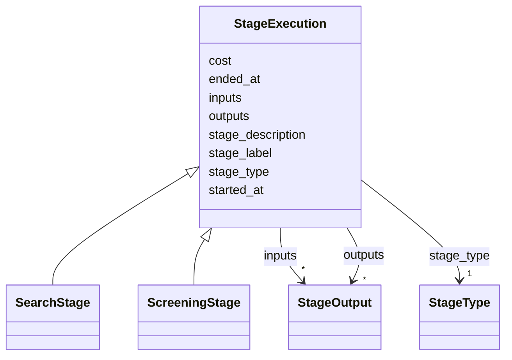

# Class: StageExecution 


_Base class for executing a specific stage of the review. Stages should extend this with their specific needs._


URI: [revaise:StageExecution](https://open-and-sustainable.github.io/revaise-model/schema/StageExecution)





## Inheritance
* **StageExecution**
    * [SearchStage](SearchStage.md)
    * [ScreeningStage](ScreeningStage.md)


## Slots

| Name | Cardinality and Range | Description | Inheritance |
| ---  | --- | --- | --- |
| [stage_type](stage_type.md) | 1 <br/> [StageType](StageType.md) | Type of stage being executed | direct |
| [stage_label](stage_label.md) | 0..1 <br/> [String](String.md) | Human-readable label for this stage execution | direct |
| [stage_description](stage_description.md) | 0..1 <br/> [String](String.md) | Description of what was done in this stage | direct |
| [started_at](started_at.md) | 0..1 <br/> [Datetime](Datetime.md) | When this stage started | direct |
| [ended_at](ended_at.md) | 0..1 <br/> [Datetime](Datetime.md) | When this stage ended | direct |
| [inputs](inputs.md) | * <br/> [StageOutput](StageOutput.md) | Input artifacts for this stage | direct |
| [outputs](outputs.md) | * <br/> [StageOutput](StageOutput.md) | Output artifacts produced by this stage | direct |
| [cost](cost.md) | 0..1 <br/> [Float](Float.md) | Estimated cost of this stage | direct |


## Usages

| used by | used in | type | used |
| ---  | --- | --- | --- |
| [Review](Review.md) | [stages](stages.md) | range | [StageExecution](StageExecution.md) |


## Identifier and Mapping Information


### Schema Source


* from schema: https://open-and-sustainable.github.io/revaise-model/schema


## Mappings

| Mapping Type | Mapped Value |
| ---  | ---  |
| self | revaise:StageExecution |
| native | revaise:StageExecution |


## LinkML Source

<!-- TODO: investigate https://stackoverflow.com/questions/37606292/how-to-create-tabbed-code-blocks-in-mkdocs-or-sphinx -->

### Direct

<details>
```yaml
name: StageExecution
description: Base class for executing a specific stage of the review. Stages should
  extend this with their specific needs.
from_schema: https://open-and-sustainable.github.io/revaise-model/schema
slots:
- stage_type
- stage_label
- stage_description
- started_at
- ended_at
- inputs
- outputs
- cost
slot_usage:
  stage_type:
    name: stage_type
    description: Type of stage being executed
    range: StageType
    required: true
  stage_label:
    name: stage_label
    description: Human-readable label for this stage execution
    range: string
  stage_description:
    name: stage_description
    description: Description of what was done in this stage
    range: string
  started_at:
    name: started_at
    description: When this stage started
    range: datetime
  ended_at:
    name: ended_at
    description: When this stage ended
    range: datetime
  inputs:
    name: inputs
    description: Input artifacts for this stage
    range: StageOutput
    multivalued: true
  outputs:
    name: outputs
    description: Output artifacts produced by this stage
    range: StageOutput
    multivalued: true
  cost:
    name: cost
    description: Estimated cost of this stage
    range: float
    minimum_value: 0

```
</details>

### Induced

<details>
```yaml
name: StageExecution
description: Base class for executing a specific stage of the review. Stages should
  extend this with their specific needs.
from_schema: https://open-and-sustainable.github.io/revaise-model/schema
slot_usage:
  stage_type:
    name: stage_type
    description: Type of stage being executed
    range: StageType
    required: true
  stage_label:
    name: stage_label
    description: Human-readable label for this stage execution
    range: string
  stage_description:
    name: stage_description
    description: Description of what was done in this stage
    range: string
  started_at:
    name: started_at
    description: When this stage started
    range: datetime
  ended_at:
    name: ended_at
    description: When this stage ended
    range: datetime
  inputs:
    name: inputs
    description: Input artifacts for this stage
    range: StageOutput
    multivalued: true
  outputs:
    name: outputs
    description: Output artifacts produced by this stage
    range: StageOutput
    multivalued: true
  cost:
    name: cost
    description: Estimated cost of this stage
    range: float
    minimum_value: 0
attributes:
  stage_type:
    name: stage_type
    description: Type of stage being executed
    from_schema: https://open-and-sustainable.github.io/revaise-model/schema
    rank: 1000
    alias: stage_type
    owner: StageExecution
    domain_of:
    - StageExecution
    range: StageType
    required: true
  stage_label:
    name: stage_label
    description: Human-readable label for this stage execution
    from_schema: https://open-and-sustainable.github.io/revaise-model/schema
    rank: 1000
    alias: stage_label
    owner: StageExecution
    domain_of:
    - StageExecution
    range: string
  stage_description:
    name: stage_description
    description: Description of what was done in this stage
    from_schema: https://open-and-sustainable.github.io/revaise-model/schema
    rank: 1000
    alias: stage_description
    owner: StageExecution
    domain_of:
    - StageExecution
    range: string
  started_at:
    name: started_at
    description: When this stage started
    from_schema: https://open-and-sustainable.github.io/revaise-model/schema
    rank: 1000
    alias: started_at
    owner: StageExecution
    domain_of:
    - StageExecution
    range: datetime
  ended_at:
    name: ended_at
    description: When this stage ended
    from_schema: https://open-and-sustainable.github.io/revaise-model/schema
    rank: 1000
    alias: ended_at
    owner: StageExecution
    domain_of:
    - StageExecution
    range: datetime
  inputs:
    name: inputs
    description: Input artifacts for this stage
    from_schema: https://open-and-sustainable.github.io/revaise-model/schema
    rank: 1000
    alias: inputs
    owner: StageExecution
    domain_of:
    - StageExecution
    range: StageOutput
    multivalued: true
  outputs:
    name: outputs
    description: Output artifacts produced by this stage
    from_schema: https://open-and-sustainable.github.io/revaise-model/schema
    rank: 1000
    alias: outputs
    owner: StageExecution
    domain_of:
    - StageExecution
    range: StageOutput
    multivalued: true
  cost:
    name: cost
    description: Estimated cost of this stage
    from_schema: https://open-and-sustainable.github.io/revaise-model/schema
    rank: 1000
    alias: cost
    owner: StageExecution
    domain_of:
    - StageExecution
    range: float
    minimum_value: 0

```
</details>