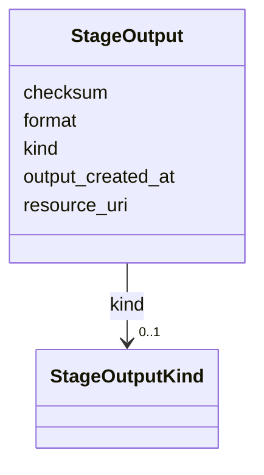

# Class: StageOutput 


_Output file or log produced by a review stage (results, logs, code, visualizations)._


URI: [revaise:StageOutput](https://open-and-sustainable.github.io/revaise-model/schema/StageOutput)





<!-- no inheritance hierarchy -->


## Slots

| Name | Cardinality and Range | Description | Inheritance |
| ---  | --- | --- | --- |
| [kind](kind.md) | 0..1 <br/> [StageOutputKind](StageOutputKind.md) | Kind or type of stage output | direct |
| [resource_uri](resource_uri.md) | 0..1 <br/> [Uri](Uri.md) | URI locating the resource | direct |
| [format](format.md) | 0..1 <br/> [String](String.md) | File format or MIME type | direct |
| [checksum](checksum.md) | 0..1 <br/> [String](String.md) | Checksum of the output file | direct |
| [output_created_at](output_created_at.md) | 0..1 <br/> [Datetime](Datetime.md) | Creation timestamp | direct |


## Usages

| used by | used in | type | used |
| ---  | --- | --- | --- |
| [SearchStage](SearchStage.md) | [inputs](inputs.md) | range | [StageOutput](StageOutput.md) |
| [SearchStage](SearchStage.md) | [outputs](outputs.md) | range | [StageOutput](StageOutput.md) |
| [Review](Review.md) | [stage_outputs](stage_outputs.md) | range | [StageOutput](StageOutput.md) |
| [StageExecution](StageExecution.md) | [inputs](inputs.md) | range | [StageOutput](StageOutput.md) |
| [StageExecution](StageExecution.md) | [outputs](outputs.md) | range | [StageOutput](StageOutput.md) |
| [ScreeningStage](ScreeningStage.md) | [inputs](inputs.md) | range | [StageOutput](StageOutput.md) |
| [ScreeningStage](ScreeningStage.md) | [outputs](outputs.md) | range | [StageOutput](StageOutput.md) |


## Identifier and Mapping Information


### Schema Source


* from schema: https://open-and-sustainable.github.io/revaise-model/schema


## Mappings

| Mapping Type | Mapped Value |
| ---  | ---  |
| self | revaise:StageOutput |
| native | revaise:StageOutput |


## LinkML Source

<!-- TODO: investigate https://stackoverflow.com/questions/37606292/how-to-create-tabbed-code-blocks-in-mkdocs-or-sphinx -->

### Direct

<details>
```yaml
name: StageOutput
description: Output file or log produced by a review stage (results, logs, code, visualizations).
from_schema: https://open-and-sustainable.github.io/revaise-model/schema
slots:
- kind
- resource_uri
- format
- checksum
- output_created_at
slot_usage:
  kind:
    name: kind
    range: StageOutputKind

```
</details>

### Induced

<details>
```yaml
name: StageOutput
description: Output file or log produced by a review stage (results, logs, code, visualizations).
from_schema: https://open-and-sustainable.github.io/revaise-model/schema
slot_usage:
  kind:
    name: kind
    range: StageOutputKind
attributes:
  kind:
    name: kind
    description: Kind or type of stage output
    from_schema: https://open-and-sustainable.github.io/revaise-model/schema
    rank: 1000
    alias: kind
    owner: StageOutput
    domain_of:
    - StageOutput
    - DatasetRef
    range: StageOutputKind
  resource_uri:
    name: resource_uri
    description: URI locating the resource
    from_schema: https://open-and-sustainable.github.io/revaise-model/schema
    rank: 1000
    alias: resource_uri
    owner: StageOutput
    domain_of:
    - StageOutput
    - StageOutputRef
    - DatasetRef
    range: uri
  format:
    name: format
    description: File format or MIME type
    from_schema: https://open-and-sustainable.github.io/revaise-model/schema
    rank: 1000
    alias: format
    owner: StageOutput
    domain_of:
    - StageOutput
    range: string
  checksum:
    name: checksum
    description: Checksum of the output file
    from_schema: https://open-and-sustainable.github.io/revaise-model/schema
    rank: 1000
    alias: checksum
    owner: StageOutput
    domain_of:
    - StageOutput
    - StageOutputRef
    range: string
  output_created_at:
    name: output_created_at
    description: Creation timestamp
    from_schema: https://open-and-sustainable.github.io/revaise-model/schema
    rank: 1000
    alias: output_created_at
    owner: StageOutput
    domain_of:
    - StageOutput
    range: datetime

```
</details>