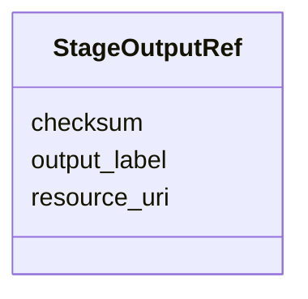

# Class: StageOutputRef 


_Reference to a stage output in this or another RevAIse bundle._


URI: [revaise:StageOutputRef](https://open-and-sustainable.github.io/revaise-model/schema/StageOutputRef)





<!-- no inheritance hierarchy -->


## Slots

| Name | Cardinality and Range | Description | Inheritance |
| ---  | --- | --- | --- |
| [resource_uri](resource_uri.md) | 0..1 <br/> [Uri](Uri.md) | URI locating the resource | direct |
| [checksum](checksum.md) | 0..1 <br/> [String](String.md) | Checksum of the output file | direct |
| [output_label](output_label.md) | 0..1 <br/> [String](String.md) | Human-readable label | direct |


## Usages

| used by | used in | type | used |
| ---  | --- | --- | --- |
| [SoftwareEnv](SoftwareEnv.md) | [containers](containers.md) | range | [StageOutputRef](StageOutputRef.md) |
| [SoftwareEnv](SoftwareEnv.md) | [lockfiles](lockfiles.md) | range | [StageOutputRef](StageOutputRef.md) |


## Identifier and Mapping Information


### Schema Source


* from schema: https://open-and-sustainable.github.io/revaise-model/schema


## Mappings

| Mapping Type | Mapped Value |
| ---  | ---  |
| self | revaise:StageOutputRef |
| native | revaise:StageOutputRef |


## LinkML Source

<!-- TODO: investigate https://stackoverflow.com/questions/37606292/how-to-create-tabbed-code-blocks-in-mkdocs-or-sphinx -->

### Direct

<details>
```yaml
name: StageOutputRef
description: Reference to a stage output in this or another RevAIse bundle.
from_schema: https://open-and-sustainable.github.io/revaise-model/schema
slots:
- resource_uri
- checksum
- output_label

```
</details>

### Induced

<details>
```yaml
name: StageOutputRef
description: Reference to a stage output in this or another RevAIse bundle.
from_schema: https://open-and-sustainable.github.io/revaise-model/schema
attributes:
  resource_uri:
    name: resource_uri
    description: URI locating the resource
    from_schema: https://open-and-sustainable.github.io/revaise-model/schema
    rank: 1000
    alias: resource_uri
    owner: StageOutputRef
    domain_of:
    - StageOutput
    - StageOutputRef
    - DatasetRef
    range: uri
  checksum:
    name: checksum
    description: Checksum of the output file
    from_schema: https://open-and-sustainable.github.io/revaise-model/schema
    rank: 1000
    alias: checksum
    owner: StageOutputRef
    domain_of:
    - StageOutput
    - StageOutputRef
    range: string
  output_label:
    name: output_label
    description: Human-readable label
    from_schema: https://open-and-sustainable.github.io/revaise-model/schema
    rank: 1000
    alias: output_label
    owner: StageOutputRef
    domain_of:
    - StageOutputRef
    range: string

```
</details>